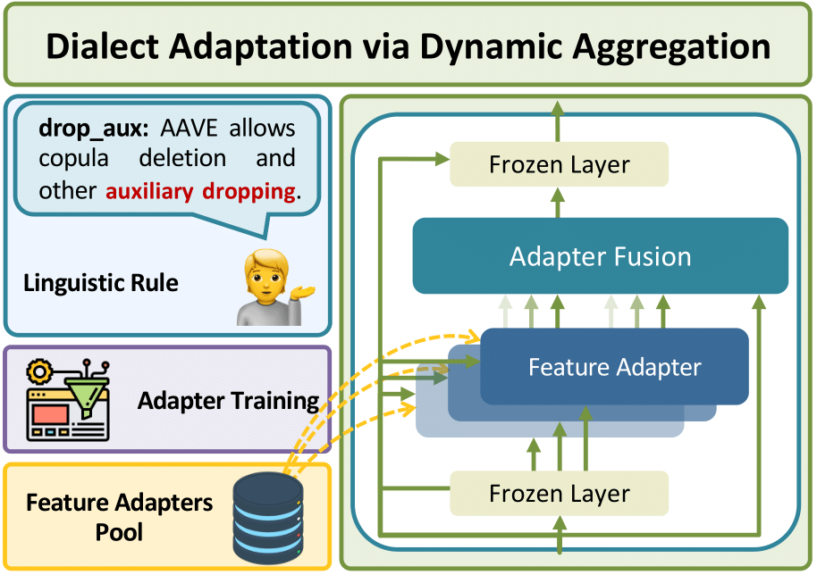
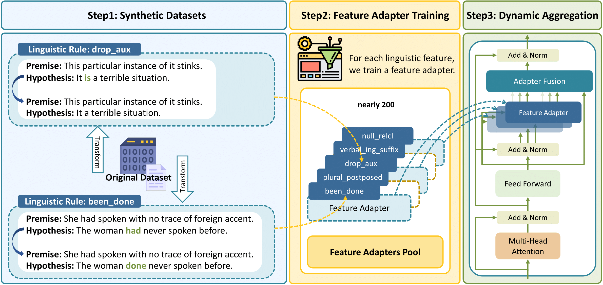

#  DADA: Dialect Adaptation via Dynamic Aggregation of Linguistic Rules

This repository contains the code implementation for the paper titled "[DADA: Dialect Adaptation via Dynamic Aggregation of Linguistic Rules](https://arxiv.org/abs/2305.13406)". 

<p align="center">
    
</p>

The description for code implementation will come soon.

<!--  -->


## Table of Contents

- [0. Abstract](#abstract)
- [1. Installation](#installation)
- [2. Usage](#usage)
- [3. Citation and Contact](#citation-and-contact)

## Abstract
Existing large language models (LLMs) that mainly focus on Standard American English (SAE) often lead to significantly worse performance when being applied to other English dialects. While existing mitigations tackle discrepancies for individual target dialects, they assume access to high-accuracy dialect identification systems. The boundaries between dialects are inherently flexible, making it difficult to categorize language into discrete predefined categories. In this paper, we propose DADA (Dialect Adaptation via Dynamic Aggregation), a modular approach to imbue SAE-trained models with multi-dialectal robustness by composing adapters which handle specific linguistic features. The compositional architecture of DADA allows for both targeted adaptation to specific dialect variants and simultaneous adaptation to various dialects. We show that DADA is effective for both single task and instruction finetuned language models, offering an extensible and interpretable framework for adapting existing LLMs to different English dialects.

## Installation
please run the command below to install the dependent libraries.

```
conda create -n dada python=3.8
conda activate dada
conda install --file requirements.txt
```

<!--
## Usage

Explain how to use the code and provide examples if applicable. Describe the different functionalities, options, or parameters available. Include any specific instructions or guidelines for running experiments or reproducing results.

## License

Specify the license under which the code is released. If applicable, mention any open-source licenses or restrictions.
 -->
 
## Citation and Contact

If you find this repository helpful, please cite our paper.

```
@inproceedings{liu2023dada,
    title={DADA: Dialect Adaptation via Dynamic Aggregation of Linguistic Rules},
    author={Yanchen Liu and William Held and Diyi Yang},
    year={2023},
    eprint={2305.13406},
    archivePrefix={arXiv},
    primaryClass={cs.CL}
}
```

Feel free to contact Yanchen at yanchenliu@g.harvard.edu, if you have any questions about the paper.


